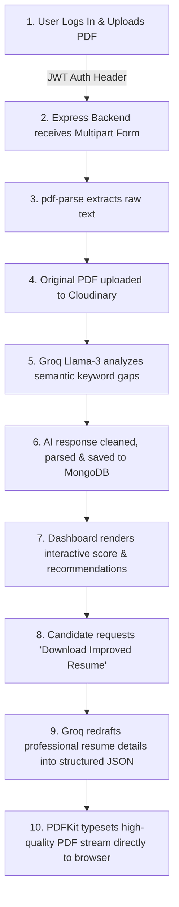

# 🚀 AI-Powered Resume Analyzer

An advanced, full-stack SaaS application designed to help job seekers optimize their resumes for Applicant Tracking Systems (ATS). By leveraging the state-of-the-art **Groq Llama-3 (8B)** model and professional PDF generation libraries, the platform parses resumes, performs semantic keyword gap analysis, provides actionable suggestions, and dynamically redrafts/typesets highly-optimized, ATS-compliant PDF resumes.

---

## 📌 Architectural Overview

The application is built on a modern decoupled architecture:
* **Frontend**: React (Vite) + Tailwind CSS + React Router + Axios (with automatic 401 session interceptors).
* **Backend**: Node.js + Express + JWT authentication.
* **Database**: MongoDB (Mongoose schemas tracking secure, salt-hashed user accounts and historically analyzed resumes).
* **Cloud Storage**: Cloudinary (for secure, persistent resume PDF hosting).
* **AI Engine**: Groq SDK powered by the ultra-fast Llama-3.1-8B-Instant model.
* **PDF Engine**: PDFKit (for dynamic, professional typographic typesetting of improved resumes).

---

## 🔍 The Step-by-Step Resume Analysis Pipeline

From the moment a candidate logs in to the instant they download a refined, ATS-optimized resume, the application coordinates multiple background services. Here is the step-by-step lifecycle of a resume analysis:



### 🟩 Step 1: Secure Upload & Payload Validation
1. **Authentication Guard**: The user navigates to `/upload` (guarded on the frontend by `<ProtectedRoute>` and validated on the backend via the `verifyToken` JWT middleware).
2. **Payload Selection**: The user selects their target professional role (e.g., Frontend Developer, DevOps Engineer, Data Scientist) and selects their resume PDF.
3. **Transmission**: The frontend encapsulates the file as `multipart/form-data` and dispatches it via a secure POST request to the backend with the bearer token attached to the `Authorization` header.

### 🟩 Step 2: High-Performance PDF Parsing
1. **Buffer Intake**: The Express server intercepts the upload stream using `multer` to securely buffer the file in memory without writing temp files to disk.
2. **Text Extraction**: The `pdf-parse-fixed` library extracts raw unicode text strings from the multi-page binary PDF stream, preparing it for natural language processing.

### 🟩 Step 3: Cloud Archiving & Role Mapping
1. **Remote Backup**: The backend concurrently uploads the raw PDF buffer to Cloudinary, obtaining a secure, SSL-encrypted URL (`fileUrl`) for archival.
2. **JD Semantic Loading**: The selected role is matched against professional baseline templates in the schema (e.g., identifying required keywords like *Docker*, *CI/CD*, *Kubernetes* for a DevOps role).

### 🟩 Step 4: Groq Llama-3 Semantic Keyword Analysis
1. **Prompt Engineering**: The backend dynamically generates a highly structured system-style prompt containing:
   * Target role and standard job descriptions.
   * Baseline required skills.
   * Candidate's parsed raw resume text (truncated to 3,000 characters to prevent context overflow).
2. **Strict JSON Instruction**: The model is instructed to output **exclusively** valid, raw JSON containing:
   ```json
   {
     "score": 85,
     "matchedKeywords": ["React", "CSS", "Tailwind"],
     "missingKeywords": ["TypeScript", "Next.js"],
     "suggestions": ["Add measurable metrics to project achievements."]
   }
   ```
3. **Execution**: The backend dispatches a high-speed completion query to the **Groq Llama-3.1-8B-Instant** model, which returns the structured response in milliseconds.

### 🟩 Step 5: JSON Extraction, Validation, and MongoDB Persistence
1. **Regex Cleaning**: The Express server intercepts the raw AI string, utilizes regular expressions to strip any accidental Markdown wrapping (like ` ```json ` blocks), and extracts the inner brackets `{...}`.
2. **Validation**: The JSON is parsed into a structured JavaScript object, validating the presence of the ATS `score`, keywords, and recommendations.
3. **Database Integration**: The backend queries the database using `req.user.userId` (extracted from the JWT token), pushes the new resume record (including title, Cloudinary link, and complete AI analysis object) into the user's Mongoose array, and saves the user instance.

### 🟩 Step 6: Interactive Dashboard UI Rendering
1. **State Update**: The backend sends a `201 Created` status with the parsed JSON back to the frontend.
2. **Interactive Visualization**: The frontend dynamically renders:
   * An **ATS Score Circle** indicating candidate readiness.
   * **Pill Badges** mapping matching vs. missing keyword gaps in vivid green and red UI colors.
   * A **Bullet List** of actionable, step-by-step AI recommendations.

### 🟩 Step 7: Dynamic Redrafting & Professional PDF Generation (Download)
If the user clicks **Download Improved Resume**:
1. **Advanced Rewrite**: A backend request fetches the original resume text and its analysis. A separate, specialized Groq AI prompt instructs Llama-3 to completely rewrite and optimize the user's work experience and projects. It aligns their details into accomplishment-oriented bullet points (utilizing Google's **XYZ Formula**: *Accomplished [X], as measured by [Y], by doing [Z]*), naturally integrating the previously missing keywords.
2. **Structured Delivery**: Llama-3 returns a structured JSON matching an absolute professional resume schema (summary, experience list, projects, skills).
3. **PDFKit Typesetting**: The backend instantiates a `PDFDocument` via `pdfkit`, dynamically calculating text wrap, page breaks, margins, and professional typography. It draws standard Navy/Slate color themes and stream-pipes the raw PDF buffer directly to the user's browser, downloading a perfectly typeset, ATS-optimized document.

---

## ⚙️ Environment Configuration

Create a `.env` file inside the `backend/` directory:

```env
# Database
DB_URL=your_mongodb_connection_string

# Server
PORT=3000
SECRET_KEY=your_secure_jwt_token_secret

# Cloudinary Storage
CLOUDINARY_CLOUD_NAME=your_cloudinary_cloud_name
CLOUDINARY_API_KEY=your_cloudinary_api_key
CLOUDINARY_API_SECRET=your_cloudinary_api_secret

# AI Engine
GROQ_API_KEY=your_groq_api_key
```

And in the `frontend` environment settings (during local dev, defaults to `http://localhost:3000`):
* `VITE_API_URL`: Set this to your production backend URL (e.g. `https://your-api.onrender.com`).

---

## 🛠️ Local Setup & Installation

### 1. Clone the repository
```bash
git clone https://github.com/devanirudhn/AiPoweredResumeAnalyser.git
cd AiPoweredResumeAnalyser
```

### 2. Start the Backend
```bash
cd backend
npm install
# Configure your .env file
npm start
```

### 3. Start the Frontend
```bash
cd ../frontend
npm install
npm run dev
```
Open `http://localhost:5173` in your browser.

---

## 🏁 Conclusion

The **AI-Powered Resume Analyzer** demonstrates how modern cloud microservices can combine to solve a complex, real-world challenge. By dividing the pipeline into distinct modules—secure validation, precise parsing, high-speed LLM processing, clean data structure persistence, and high-fidelity PDF rendering—the system provides a seamless, secure, and production-grade software utility. Candidates obtain a direct, measurable advantage in their job searches through professional, automated resume refinement.